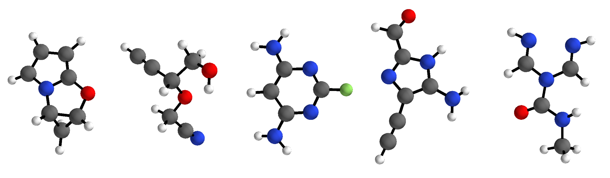
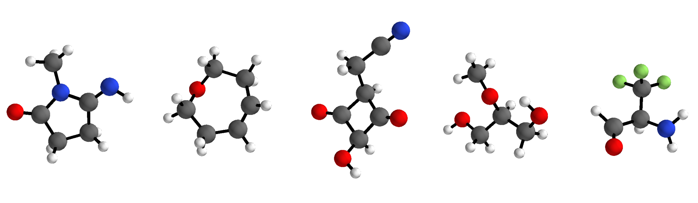

# G-SchNet

Implementation of G-SchNet - a generative model for 3d molecular structures - accompanying the paper [_"Symmetry-adapted generation of 3d point sets for the targeted discovery of molecules"_](http://papers.nips.cc/paper/8974-symmetry-adapted-generation-of-3d-point-sets-for-the-targeted-discovery-of-molecules) published at NeurIPS 2019. 

G-SchNet generates molecules in an autoregressive fashion, placing one atom after another in 3d euclidean space. The model can be trained on data sets with molecules of variable size and composition. It only uses the positions and types of atoms in a molecule, needing no bond-based information such as molecular graphs.

The code provided in this repository allows to train G-SchNet on the QM9 data set which consists of approximately 130k small molecules with up to nine heavy atoms from fluorine, oxygen, nitrogen, and carbon. We provide the pre- and post-processing routines used in our paper's experiments with QM9 molecules in order to make our results reproducible. Although the code and the following guide is very much tailored to QM9, we also provide a few template scripts with basic functionality that can serve as a solid starting point for the application of G-SchNet to other data sets with differently composed molecular structures. The corresponding description can be found at the bottom of this readme after the introduction to the QM9 scripts. 

### Requirements
- schnetpack 0.3
- pytorch >= 1.2
- python >= 3.7
- ASE >= 3.17.0
- Open Babel 2.41
- rdkit >= 2019.03.4.0

The following commands will create a new conda environment called _"gschnet"_ and install all dependencies (tested on Ubuntu 18.04):

    conda create -n gschnet python=3.7 pytorch=1.5.0 torchvision cudatoolkit=10.2 ase=3.19.0 openbabel=2.4.1 rdkit=2019.09.2.0 -c pytorch -c openbabel -c defaults -c conda-forge
    conda activate gschnet
    pip install 'schnetpack==0.3'
    
Replace _"cudatoolkit=10.2"_ with _"cpuonly"_ if you do not want to utilize a GPU for training/generation. However, we strongly recommend to use a GPU if available.

# Getting started with G-SchNet and QM9
Clone the repository into your folder of choice:

    git clone https://github.com/atomistic-machine-learning/G-SchNet.git

### Training a model
A model with the same settings as described in the paper can be trained by running gschnet_script.py with standard parameters:

    python ./G-SchNet/gschnet_script.py train gschnet ./data/ ./models/gschnet/ --split 50000 5000 --cuda

The training data (QM9) is automatically downloaded and preprocessed if not present in ./data/ and the model will be stored in ./models/gschnet/. 
With _--split 50000 5000_, 50k molecules are used as the training set, 5k are used for validation, and the remaining structures are left out as a test set.
We recommend to train on a GPU but you can remove _--cuda_ from the call to use the CPU instead. If your GPU has less than 16GB VRAM, you need to decrease the number of features (e.g. _--features 64_) or the depth of the network (e.g. _--interactions 6_).

At the bottom of this page, we provide a model trained exactly as described above for download. Feel free to use it instead of training your own model.

### Generating molecules
Running the script with the following arguments will generate 1000 molecules using the trained model at ./model/geschnet/ and store them in ./model/gschnet/generated/generated.mol_dict:

    python ./G-SchNet/gschnet_script.py generate gschnet ./models/gschnet/ 1000 --cuda

Remove _--cuda_ from the call if you want to run on the CPU. Add _--show_gen_ to display the molecules with ASE after generation. If you are running into problems due to small VRAM, decrease the size of mini-batches during generation (e.g. _--chunk_size 500_, default is 1000).

### Filtering and analysis of generated molecules
After generation, the generated molecules can be filtered for invalid and duplicate structures by running qm9_filter_generated.py:

    python ./G-SchNet/qm9_filter_generated.py ./models/gschnet/generated/generated.mol_dict --train_data_path ./data/qm9gen.db --model_path ./models/gschnet
    
The script will print its progress and the gathered results. To store them in a file, please redirect the console output to a file (e.g. ./results.txt) and use the _--print_file_ argument when calling the script:

    python ./G-SchNet/qm9_filter_generated.py ./models/gschnet/generated/generated.mol_dict --train_data_path ./data/qm9gen.db --model_path ./models/gschnet --print_file >> ./results.txt
    
The script checks the valency constraints (e.g. every hydrogen atom should have exactly one bond), the connectedness (i.e. all atoms in a molecule should be connected to each other via a path over bonds), and removes duplicates*. The remaining valid structures are stored in an sqlite database with ASE (at ./models/gschnet/generated/generated_molecules.db) along with an .npz-file that records certain statistics (e.g. the number of rings of certain sizes, the number of single, double, and triple bonds, the index of the matching training/test data molecule etc. for each molecule, see tables below for an overview showing all stored statistics).

*_Please note that, as described in the paper, we use molecular fingerprints and canonical smiles representations to identify duplicates which means that different spatial conformers corresponding to the same canonical smiles string are tagged as duplicates and removed in the process. Add '--filters valence disconnected' to the call in order to not remove but keep identified duplicates in the created database._

### Displaying generated and QM9 training data molecules
After filtering, all generated molecules stored in the sqlite database can be displayed with ASE as follows:

    python ./G-SchNet/display_molecules.py --data_path ./models/gschnet/generated/generated_molecules.db

The script allows to query the generated molecules for structures with certain properties using _--select "selection string"_. The selection string has the general format _"Property,OperatorTarget"_ (e.g. _"C,>8"_ to filter for all molecules with more than eight carbon atoms where _"C"_ is the statistic counting the number of carbon atoms in a molecule, _">"_ is the operator, and _"8"_ is the target value). Multiple conditions can be combined to form one selection string using _"&"_ (e.g _"C,>8&R5,>0"_ to get all molecules with more than 8 carbon atoms and at least 1 ring of size 5). Furthermore, multiple selection strings may be provided such that multiple windows with molecule plots are opened (one per selection string). The available operators are _"<", "<=", "=", "!=", ">=",_ and _">"_. Properties may be summed together using _"+"_ (e.g. _"R5+R6,=1"_ to get molecules with exactly one ring of size 5 or 6). For a list of all available properties, see the tables below.

An example call to display all generated molecules that consist of at least 7 carbon atoms and two rings of size 6 or 5 and to display all generated molecules that have at least 1 Fluorine atom:
   
    python ./G-SchNet/display_molecules.py --data_path ./models/gschnet/generated/generated_molecules.db --select "C,>=7&R5+R6,=2" "F,>=1"
    
The same script can also be used to display molecules from the QM9 training database using _--train_data_path_:
    
    python ./G-SchNet/display_molecules.py --train_data_path ./data/qm9gen.db
    
Note that displaying all ~130k molecules from the database is quite slow. However, the training database can also be queried in a similar manner by prepending _"training"_ to the selection string. For example, the following call will display all molecules from the QM9 database that have at least one Fluorine atom and not more than 5 other heavy atoms:

    python ./G-SchNet/display_molecules.py --train_data_path ./data/qm9gen.db --select "training F,>=1&C+N+O,<=5"
    
Using _--train_ or _--test_ with _--data_path_ will display all generated molecules that match structures used for training or held out test data, respectively, and the corresponding reference molecules from the QM9 database if _--train_data_path_ is also provided. _--novel_ will display all generated molecules that match neither structures used for training nor held out test data.

The indices of molecules matching the queries can be exported using _--export_to_dir_. For example, the indices of all molecules from QM9 with HOMO-LUMO gap < 4.5 eV will be stored as numpy-readable file _training gap,<=4.5.npy_ at ./data/subsets/ by calling:

    python ./G-SchNet/display_molecules.py --train_data_path ./data/qm9gen.db --select "training gap,<=4.5" --export_to_dir ./data/subsets

The following properties are available for __both generated molecules as well as structures in the QM9 training database__:

| property | description |
|---|---|
| n_atoms | total number of atoms |
| C, N, O, F, H | number of atoms of the respective type |
| H1C, C2C, N1O, ... | number of covalent bonds of a certain kind (single, double, triple) between two specific atom types (the types are ordere by increasing nuclear charge, i.e. write C3N not N3C) |
| R3, ..., R8, R>8 | number of rings of a certain size (3-8, >8) |

Additionally, __generated molecules__ allow to use the following properties in selection strings:

| property | description |
|---|---|
| known | whether the molecule is novel (0) or matches a structure used for training (1), used for validation (2), or from the held out test data (3) |
| equals | the index of the matching molecule in the training database (if known is 1, 2, or 3) or -1 (if known is 0) |
| n_duplicates | the number of times the particular molecule was generated (0 if duplicating is not -1) |
| duplicating | this is -1 for all "original" structures (i.e. the first occurence of a generated molecule) and the index of the original structure if the generated molecule is a duplicate (in the default settings only original, i.e. unique, structures are stored in the database) |
| valid | whether the molecule passed the validity check during filtering (i.e. the valency, connectedness and uniquess checks, in the default settings only valid molecules are stored in the databbase) |

Finally, molecules from the __QM9 training database__ can also be queried for properties available in the QM9 data set:

| property | unit | description |
|---|---|---|
| dipole_moment | e*Ångström | length of the dipole moment |
| isotropic_polarizability | Ångström³ | isotropic polarizability |
| homo | eV | energy of highest occupied molecular orbital (HOMO) |
| lumo | eV | energy of lowest unoccupied molecular orbital (LUMO) |
| gap | eV | energy difference between the HOMO and LUMO (HOMO-LUMO gap) |
| electronic_spatial_extent | Ångström² | electronic spatial extent |
| zpve | eV | zero point vibrational energy |
| energy_U0 | eV | internal energy at 0 K |
| energy_U | eV | internal energy at 298.15 K |
| enthalpy_H | eV | enthalpy at 298.15 K |
| free_energy | eV | free energy at 298.15 K |
| heat_capacity | cal/(molK) | heat capacity at 298.15 K |

All properties use the ASE-internal units and therefore can easily be converted with ASE. For example, you can get the dipole moment in Debye by multiplying it with 1/ase.units.Debye. Similarly, the isotropic polarizability can be converted to Bohr³ using 1/ase.units.Bohr³ and the electronic spatial extent may be obtained in Bohr² with 1/ase.units.Bohr².

### Training a biased model
The generation of molecules with G-SchNet can be biased towards desired target properties of QM9 molecules. To this end, the weights of an already trained model are fine-tuned in a second training run where only a small number of molecules that exhibit the desired target property is used as training data. For example, we biased the generation towards molecules with a small HOMO-LUMO gap in our paper. We found that the pre-training with a large and diverse set of molecules would increase the robustness of the learned model (e.g. increase the number of generated molecules that are valid structures) compared to training on the small subset directly.

The second training run for biasing is started with the same script as the usual training but requires two additional parameters. This is the path to an already trained model that is used to initialize the weights and the path to a file holding the indices of molecules that exhibit the desired target property. Such a file can be obtained using the display_molecules script (see description in the section above, where we extract the indices of all molecules with HOMO-LUMO gap smaller than 4.5 eV).

Assume there is a model already trained on 50k examples from QM9 at ./models/gschnet and a file with the indices of 3000 molecules that exhibit the desired target property at ./data/subsets/indices.npy, then a biased model can be trained with the following call:

    python ./G-SchNet/gschnet_script.py train gschnet ./data/ ./models/biased_gschnet/ --split 2000 500 --cuda --pretrained_path ./models/gschnet --subset_path ./data/subsets/indices.npy
   
The argument _--split_ needs to be adjusted according to the number of molecules available in the subset. Note that the learning rate parameters can also be adjusted with _--lr, --lr_decay, --lr_patience,_ and _--lr_min_, which are 1e-4, 0.5, 10, and 1e-6 per default, respectively. In our paper, we used these standard parameters for the pre-training as well as for the fine-tuning with respect to small HOMO-LUMO gaps, where we had 3.3k molecules for training and 0.5k for validation. If there are significanly less molecules exhibiting the target property, it could be better to decrease the learning rate for the fine-tuning step such that overfitting is prevented as more information from the pre-trained weights is retained. On the contrary, if there is a larger subset of molecules with the target property, training G-SchNet directly on that subset might lead to similarly good results as starting from the pre-trained weights.

After the training has converged, molecules can be sampled from the biased distribution and filtererd afterwards just as before and described in the previous sections (but of course the path to the model directory ./models/geschnet needs to be replaced with ./models/biased_gschnet in the arguments when calling the scripts).

# Applying G-SchNet to other data sets
TODO: Coming soon.

# Citation
If you are using G-SchNet in your research, please cite the corresponding paper:

N. Gebauer, M. Gastegger, and K. Schütt. Symmetry-adapted generation of 3d point sets for the targeted discovery of molecules. In H. Wallach, H. Larochelle, A. Beygelzimer, F. d'Alché-Buc, E. Fox, and R. Garnett, editors, _Advances in Neural Information Processing Systems 32_, pages 7564–7576. Curran Associates, Inc., 2019.

    @incollection{NIPS2019_8974,
    title = {Symmetry-adapted generation of 3d point sets for the targeted discovery of molecules},
    author = {Gebauer, Niklas and Gastegger, Michael and Sch\"{u}tt, Kristof},
    booktitle = {Advances in Neural Information Processing Systems 32},
    editor = {H. Wallach and H. Larochelle and A. Beygelzimer and F. d\textquotesingle Alch\'{e}-Buc and E. Fox and R. Garnett},
    pages = {7566--7578},
    year = {2019},
    publisher = {Curran Associates, Inc.},
    url = {http://papers.nips.cc/paper/8974-symmetry-adapted-generation-of-3d-point-sets-for-the-targeted-discovery-of-molecules.pdf}
    }

# Trained G-SchNet model
Here we provide an already trained G-SchNet model ready to be used for molecule generation or further fine-tuning and biasing. The model was trained as described in the paper, using the standard settings of the gschnet_script and 50k structures from QM9 (as explained in "Training a model" above). Simply extract the folder "gschnet" from the provided zip-file into ./models and continue with the steps described in "Generating molecules" or "Training a biased model" from the guide above. 
We used an environment with pytorch 1.5.0, cudatoolkit 10.2, and schnetpack 0.3 for training.

[Download here.](http://www.quantum-machine.org/data/trained_gschnet_model.zip)

The QM9 training data is usually downloaded and pre-processed as a first step of the training script. If you use our trained model from here instead of training your own model, you might still need the training data (e.g. for visualization or filtering of generated molecules). In this case, you can simply start a dummy training with zero epochs to initialize the data download and remove the dummy model afterwards:

    python ./G-SchNet/gschnet_script.py train gschnet ./data/ ./models/_dummy/ --split 1 1 --max_epochs 0
    rm -r ./models/_dummy

# Notes
This readme is currently being extended in order to cover all important topics. We will explain how a pre-trained model can be fine-tuned in order to bias generation towards a target property (small HOMO-LUMO gap) and also add the documentation for the template scripts that allow to apply the G-SchNet to data sets other than QM9.

